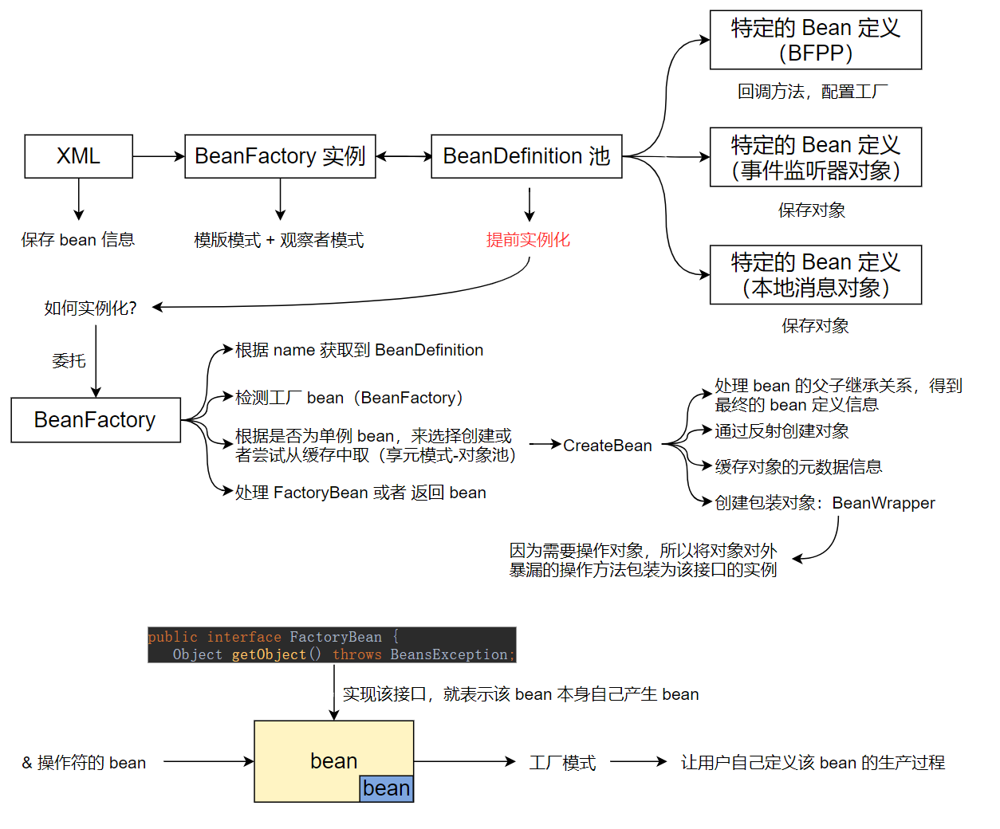

# Spring 1.0

Spring 1.0 2003 年的第一个 Spring 版本，为什么要看这么古老的一个版本呢？因为物有本末事有终始嘛，后面版本的代码就是对它的代码的增强，你可以看见后续 Spring 的代码里面，你如果用过看过高版本的源码，你可以在这里看见后面代码的影子。

## 0x00 解读 readme.txt

```
Powerful JavaBeans-based configuration management, applying Inversion-of-Control principles. This makes wiring up applications quick and easy. No more singletons littered throughout your codebase; no more arbitrary properties file. One consistent and elegant approach everywhere.
```

什么叫控制反转？

工厂模式，谁来做工厂，再加一个配置文件，需要什么往里面注就行了。就是个工厂模式，生产出对象然后把对象塞进去，你就说我要什么什么，然后 spring 工厂就生成出来一个对象，然后把这个对象给你放过去。只不过，内部不依赖工厂，工厂方法就是你的调用方需要持有工厂的对象去调用 getInstance 或者 create，而这个不需要，这就是它和工厂方法唯一不一样的地方。

再比如，原来我需要去买菜，你现在不需要了，有一个专门管菜的，你只要和他说今天我要吃什么菜，然后菜就送来了，这就是控制反转。

那么它的好处是什么呢？让我们的应用可以快速的开发且简单的开发


我有一组对象，对象之间互相依赖，如果要是直接关联对象的话，则需要使用 new 关键字，这样的代码就会出现对象之间高耦合


那么，怎么解决呢？抽中间层，用工厂方法模式套上去，对象间不相互关联，你也别 new 我我也不 new 你了，对象只做声明，告诉工厂我想要某个对象。于是这个工厂负责对象的创建，让它这个工厂里持有着这些对象，工厂说你管我要对象我怎么给你呢？你能不能通过某种方式告知一下我你需要哪个对象，我把这个对象的引用给你。


代码举例：

最初的代码是这样的，原来 A 需要依赖 B，B 需要依赖 C。

```
    class A {
        B a = new B();
    }
    class B {
        C b = new C();
    }
    class C {

    }
```

但是有一天你不需要 C 了，那么办呢？全局查找 C。于是你会怎么解决呢？是不是会对 B 或者 C 进行抽象，我写一个抽象类比如叫做 BC，我解耦嘛我把它俩的公共部分重新出来，然后向上转型。这样我是不是不强依赖 B 和 C 啦，引入中间层解耦 BC 的强依赖。

```
    class A {
        BC b = new B();
    }
    class B extends BC {
        BC c = new C();
    }
    class C extends BC {

    }
    abstract class BC {

    }
```

那如果使用上面这种代码，后期会干一件什么事？A 里面我不想用 B 了，我想把它改成 C，那就需要全局搜索，这靠谱么？于是想到工厂模式，创建 Factory 生产 bean，定义 getBean 方法，A 里面说我不想要 B 了，但不好意思你依赖的已经是 Factory.getBean()，此时全部解耦合。

```
    class A {
        BC b = Factory.getBean();
    }
    class B extends BC {
        BC c = Factory.getBean();
    }
    class C extends BC {

    }
    abstract class BC {

    }
    class Factory {
        BC getBean() {
            
        }
    }
```

如果把 Factory.getBean() 挪到构造器里面去赋值，那么是不是我们一声明就有了，那么我们称作这为控制反转。具体它是通过哪种方式放进去的与你就没有关系了，这就是 Spring 的 IoC。

Spring IoC 功能：

1.杜绝了代码里充斥着大量的 new 对象的代码，此时若后期修改该对象时，需要全局查找并替换，这非常不好，我们称之为高耦合。

2.引入增强工厂设计模式来产生对象（里面需要管理依赖关系）。

3.对象只需要声明自己需要什么，那么就会存在什么，于是与其他对象进行了松耦合。

4.我们称 IoC 的方式解耦合了依赖关系与对象创建的行为，高内聚了对象创建（IoC 容器）和对象自身业务的行为。


那么工厂需要有什么样的功能需求呢？

1. 管理依赖关系
2. 管理对象
3. 注入对象


```
JDBC abstraction layer that offers a meaningful exception hierarchy (no more pulling vendor codes out of SQLException), simplifies error handling, and greatly reduces the amount of code you'll need to write. You'll never need to write another finally block to use JDBC again.
```

JDBC 的抽象层提供了一套非常有用的异常处理机制，也就意味着你的代码里面

不会有大量的 SQL 异常，简单化了异常处理并且减少了你需要编码的数量，即你就不需要去写完整的 JDBC finally 块了。


JDBC 是 J2EE 的一个规范，它引入是为了干什么呢？由于数据库种类很多，如果任何数据库的厂商都有一套自己的 API，那么你的代码将充斥着大量的使用的对应数据库的代码，如果有一天你想换一个数据库，不好意思你需要把之前数据库的代码推翻，重新去写一套新换的数据库对应的代码。这咋能行啊，于是 JDBC 就出现了，想让程序员用你们数据库么？想的话就实现 JDBC 的规范吧，数据库厂商自己去实现 JDBC 接口，程序员按照 JDBC 提供的接口去开发，并不去关心底层是什么，于是达到了换数据库自由。


起初 JDBC 是如何写的呢？

```
        try {
            Class.forName("jdbc的提供类");
        } catch (ClassNotFoundException e) {
            throw new RuntimeException(e);
        }
        Connection connection = null;
        try {
            connection = DriverManager.getConnection("jdbc:mysql//localhost:3306/test");
            Statement statement = connection.createStatement();
            statement.execute("sql");
        } catch (SQLException e) {
            throw new RuntimeException(e);
        } finally {
            try {
                if (connection != null) {
                    connection.close();
                }
            } catch (SQLException e) {
                throw new RuntimeException(e);
            }
        }
```

你愿意写这种代码么？肯定不愿意，所以 Spring 出现了 JDBC 的模块， 解决 JDBC 使用的复杂性，简化代码。

```
Similar abstraction layer for transaction management, allowing for pluggable transaction managers, and making it easy to demarcate transactions without dealing with low-level issues. Strategies for JTA and a single JDBC DataSource are included.
```

操作 JDBC 的时候就需要事务，所以需要一个简单事务管理层，解决实务管理问题，可以依靠底层事务完成事务传播机制。

```
AOP functionality, fully integrated into Spring configuration management. You can AOP-enable any object managed by Spring, adding aspects such as declarative transaction management. With Spring, you can have declarative transaction management without EJB... even without JTA, if you're using a single database in Tomcat or another web container without JTA support.
```

什么叫切面技术呢？

我有多个对象，然后我想对这些对象在完成它们动作之前、之后或者发生异常的时候进行处理。这个时候可以想到装饰者模式或者代理模式都可以包装对象，

装饰者模式和代理模式两者有什么不同呢？

装饰者最终也要调，但是它只做功能增强，但是它必须调底层的操作。而代理模式就可以控制到底进或者不进，比如出了异常怎么做处理。


```
    interface ProxyInterface {
        void say();
    }
    static class ProxyClass implements ProxyInterface {
        @Override
        public void say() {
            System.out.println("ProxyClass say");
        }
    }
    public static void main(String[] args) {
        ProxyClass proxyClass = new ProxyClass();
        ProxyInterface instance = (ProxyInterface) Proxy.newProxyInstance(ProxyInterface.class.getClassLoader(), new Class[]{ProxyInterface.class}, new InvocationHandler() {
            @Override
            public Object invoke(Object o, Method method, Object[] objects) throws Throwable {
                System.out.println("before");
                Object result = method.invoke(proxyClass);
                System.out.println("after");
                return result;
            }
        });
        instance.say();
    }
```


这里使用了代理模式，去控制对象的行为。而又由于对象由 Spring 管理，Spring 又是一个工厂，而工厂设计模式允许在创建时对对象进行增强，于是我们就可以通过配置信息告诉 Spring 我需要对哪些对象的方法进行增强，于是批量控制这些对象，这种技术称之为 AOP。 

通俗解释 AOP 就好比一刀切多个面包，中间涂点沙拉酱，再把它拼合到一起。


```
Flexible MVC web application framework, built on core Spring functionality. This framework is highly configurable and accommodates multiple view technologies.
```

弹性的（说到弹性的就是高扩展）WEB 框架，基于 JDBC 、transaction 和 AOP 三条特性来构建的高度扩展、灵活的 MVC 框架，用于实现 web 应用。这个时候是不是就可以知道 Spring MVC 就兼具了这些功能，所以这就意味着用 Spring MVC 的容器也可以管理这些（例如 Controller），一个容器搞定。 


最初都是使用 EJB  但是由于太重了所以没有人用了，又由于 Servlet 提供的功能特别少，需要开发者写大量的代码，于是 Spring MVC 就在 Servlet 上抽象了一层，程序员就可以面向 Spring MVC 进行编程。

缺点是什么呢？

由于 Spring MVC 与 Servlet 高度耦合，所以导致 MVC 的项目不能切为传统 CS 架构。但如果项目是传统 CS 架构，此时由于传统架构使用 Spring 容器管理，唯一缺少的是 Spring MVC 的控制层和 View 层，所以只需引入 Spring MVC 子容器管理这两层即可，然后将 MVC 子容器放入 Spring 父容器中，使用父容器内的传统项目 Bean 完成 web 项目的搭建即可。这时子容器可以访问父容器，而父容器不可以访问子容器，于是隔离了父容器骚扰到子容器里面的东西，你甚至还可以放多个 MVC 容器共享 Spring 的东西。 


验证一下 Spring boot 有没有父子容器

```
@SpringBootApplication
@RestController
public class HelloApplication implements BeanFactoryAware {
	private BeanFactory beanFactory;
	@GetMapping("/")
	public String test() {
		ConfigurableBeanFactory son = (ConfigurableBeanFactory) beanFactory;
		ConfigurableBeanFactory parent = (ConfigurableBeanFactory) son.getParentBeanFactory();
		System.out.println(son);
		System.out.println(parent);
		return "hello";
	}
	public static void main(String[] args) {
		SpringApplication.run(HelloApplication.class, args);
	}
	@Override
	public void setBeanFactory(BeanFactory beanFactory) throws BeansException {
		this.beanFactory = beanFactory;
	}
}
```

从输出可得 parent 为 null，没有设定父容器，所以没有父子容器。


## 0x01 解读 lightweight_container.html

```
There's a lot of interest in what we call lightweight containers these days. We see this as the future, especially where web applications are concerned, but also for reuse of e.g. business and data access objects in both J2EE environments and standalone applications.
```


```
What is a lightweight container? EJB is perhaps the best counterexample:
什么是轻量级容器，对比 EJB 有什么优点？
Invasive API (your code depends on EJB)
必须依赖 EJB API
Container dependency (your code won't work outside of an EJB container)
只能运行在 EJB 容器内
Fixed set of capabilities that can't be configured
兼容性不可配置
Dedicated deployment steps
部署步骤复杂
Long startup time
启动需要很长时间
```

最后，肯定是 Spring 牛逼，因为在历史的长河上留下来的只有它。


## 0x02 从一个例子入手，来看一下 Spring


### 以 IDaoCountry#getAllCountries 方法为切入口

```
public List getAllCountries(Locale locale);
```

调用处 CountriesController#handleCopy

```
public ModelAndView handleCopy(HttpServletRequest request, HttpServletResponse response) throws ServletException {
		boolean copyMade = false;
		try {
			if (null != secondDaoCountry) {
				logger.info("A secondDao is configured");
				secondDaoCountry.initBase();
				logger.info("The database is initiallised");
				Locale locs[] = {Locale.US, Locale.FRANCE, Locale.GERMANY};
				for (int i = 0; i < locs.length; i++ ) {
					secondDaoCountry.saveCountries(daoCountry.getAllCountries(locs[i]), locs[i]);
				}
				copyMade = true;
				logger.info("The data is copied");
			} else {
				logger.error("No secondDao is configured. You cannot copy in a database.");
			}
		} finally {
			return new ModelAndView("copyView", "copyMade", new Boolean(copyMade));
		}
	}
```

从上面这个接口，我们很容易知道，Spring MVC 是基于 Servlet 来干的，也就是说 MVC 的 Web 应用启动了之后，丢到 Tomcat 里面的一个请求会打到我的 Spring MVC 的 Servlet 里面，由它来调用 handleCopy 这个对象，具体调用过程后面再研究，此时我们只观察 Spring 容器。


handleCopy 方法又依赖了 daoCountry，此时我们看有没有任何依赖项？有没有显示 new 对象？

```
	private IDaoCountry daoCountry;
	private IDaoCountry secondDaoCountry;
```

可以明显看到该代码里丝毫没有任何 Spring 的东西在里面，完全符合 Spring 的初衷代码完全不依赖 EJB 或者 Spring 容器，这就是轻量级容器的关键点。但是你有没有发现，现今为止所使用的高版本的 Spring 和原来完全变样了，自从引入了注解之后，它会使用 @RestController 全依赖了，完全背离了 Spring 的思想。


那么，我们依赖了 daoCountry，谁往里面注入的呢？这时候就需要找注入过程以及研究注入原理啦。

applicationContext.xml

```
<bean id="daoCountry" class="org.springframework.samples.countries.dao.DaoCountryMem" singleton="true"/>
```

countries-servlet.xml

```
	<bean id="countriesController" class="org.springframework.samples.countries.web.CountriesController">
		<property name="methodNameResolver"><ref bean="countriesMethodNameResolver"/></property>
		<property name="daoCountry"><ref external="daoCountry"/></property>
	</bean>
```

我们通过 applicationContext.xml 和 countries-servlet.xml 这两个外部的 xml 配置文件，对依赖关系进行描述，从而使得 Spring 容器可以对这些依赖关系对象进行管理。


### 查看源码，看 Spring 是怎样创建这个 Bean 的

首先得找到创建代码的地方，上下文（ApplicationContext），由于我们使用的是工程下的 xml 文件配置的，所以看下它的实现类 ClassPathXmlApplicationContext，来个调用它的样例代码

JdbcClinicTest

```
	protected void setUp() throws Exception {
		super.setUp();
		ClassPathXmlApplicationContext ctx = new ClassPathXmlApplicationContext("/testContext.xml");
		clinic = (Clinic) ctx.getBean("clinic");
	}
```

由此可见 ClassPathXmlApplicationContext 用于加载我们的 xml 配置文件，通过使用 getBean 的方式从里面拿出我们的对象。

testContext.xml

```
<beans>
	<bean id="messageSource" class="org.springframework.context.support.ResourceBundleMessageSource">	
		<property name="basename"><value>messages</value></property>										
	</bean>
  	<bean id="dataSource" class="org.springframework.jdbc.datasource.DriverManagerDataSource">
    	<property name="driverClassName"><value>org.hsqldb.jdbcDriver</value></property>
    	<property name="url"><value>jdbc:hsqldb:hsql://localhost:9001</value></property>
    	<property name="username"><value>sa</value></property>
		<property name="password"><value></value></property>
  	</bean>
	<bean id="clinic" class="petclinic.jdbc.HsqlClinic">
    	<property name="dataSource"><ref bean="dataSource"/></property>
	</bean>
</beans>
```

那么 ClassPathXmlApplicationContext 又是怎么创建的呢？又怎么进行对 testContext.xml 配置文件中的 Bean 进行读入呢？如何解析呢？这就是接下来需要研究的东西。


此时去看一下 ClassPathXmlApplicationContext 

```
public class ClassPathXmlApplicationContext extends FileSystemXmlApplicationContext {

public class FileSystemXmlApplicationContext extends AbstractXmlApplicationContext {

.....
```

一看见这种代码的继承关系，上模版方法设计模式，父类实现了完整的算法，子类扩展父类完成部分的算法功能。

ClassPathXmlApplicationContext extends FileSystemXmlApplicationContext

FileSystem 可以加载本机文件任何一个地方的配置文件，而 ClassPath 约束了父类加载路径（限制了类加载路径）。这就是面向对象思想，越往上越抽象，越往下越具体，最上层的抽象方法最容易体现整个继承树的基本功能，最下层的实现代码最容易体现实现的原理。


## 0x03 ApplicationContext 相关各接口分析

### BeanFactory 接口

```
public interface BeanFactory {
	Object getBean(String name) throws BeansException;
	Object getBean(String name, Class requiredType) throws BeansException;
	boolean isSingleton(String name) throws NoSuchBeanDefinitionException;
	String[] getAliases(String name) throws NoSuchBeanDefinitionException;
}
```

提供了从工厂里取到 Bean 或者判断当前 Bean 在工厂里面是不是单例，或者获取到别名，也即对 Bean 的获取操作。

### ListableBeanFactory 接口

```
public interface ListableBeanFactory extends BeanFactory {
	int getBeanDefinitionCount();
	String[] getBeanDefinitionNames();
	String[] getBeanDefinitionNames(Class type);
}
```

继承了 BeanFactory，提供了对工厂中的 Bean 定义信息的遍历获取操作。

### HierarchicalBeanFactory 接口

```
public interface HierarchicalBeanFactory extends BeanFactory {
	BeanFactory getParentBeanFactory();
}
```

继承了 BeanFactory，提供了父子容器，获取父容器的功能。

### MessageSource 接口

```
public interface MessageSource {
	String getMessage(String code, Object args[], String defaultMessage, Locale locale);
	String getMessage(String code, Object args[], Locale locale) throws NoSuchMessageException;
	String getMessage(MessageSourceResolvable resolvable, Locale locale) throws NoSuchMessageException;
}
```

提供了字符串的国际化支持。

### ApplicationContext 接口

```
public interface ApplicationContext extends MessageSource, ListableBeanFactory, HierarchicalBeanFactory {
	ApplicationContext getParent();
	String getDisplayName();
	long getStartupDate();
	ContextOptions getOptions();
	void refresh() throws ApplicationContextException, BeansException;
	void close() throws ApplicationContextException;
	void publishEvent(ApplicationEvent event);
	InputStream getResourceAsStream(String location) throws IOException;
	String getResourceBasePath();
	void shareObject(String key, Object o);
	Object sharedObject(String key);
	Object removeSharedObject(String key);
}
```

继承了 MessageSource，ListableBeanFactory, HierarchicalBeanFactory 接口

提供了整合 BeanFactory 等多个接口的功能的统一接口。由于工厂设计模式只有工厂与加工对象等操作函数，我们还需要具备解析、事件创建等等功能函数，我们将这些功能函数放置在统一接口中，等价于：工厂模式+它的伴随功能 = Spring 上下文 = ApplicationContext 接口。

又由于上下文存在一些操作事件：启动、刷新、停止等，可以使用观察者模式将该事件传播到外面，将外部操作与 Spring 容器解耦。于是这里出现了 `void publishEvent(ApplicationEvent event);` 功能函数用于完成事件的发布，通知外部事件监听器。


### 插曲 - 观察者模式

publishEvent 用的就是观察者模式，能够让外部的东西，感知到内部的变化，从而出发一系列的动作。于是我们使用观察者模式发布 ApplicationEvent  的事件给我其他的组件，那我的组件和 ApplicationContext 是不是就解耦合了。

高内聚了应用本身的逻辑，也就是它的算法。以及监听到了事件我要完成的动作。低耦合了完成了的这个动作和发生事件完成算法的耦合度。


### AbstractApplicationContext 抽象类

上述所有的接口，我们描述了很多个功能接口，而我们的子类只想接入到某个过程中，将众多子类的公用函数提取到父类中，然后复用这些个公用函数 ===》模版方法设计模式 ===》 父类定义算法，子类继承父类，接入该算法即可。 

于是，我们将在后面看到诸如如下的代码：

```
interface A,B,C;
AbstractXXX implements A,B,C;
YYY extends AbstractXXX; 
```


比如开发一个系统时，起初只有一个类1，然后又出现了类2，这个时候就把相同的功能函数拷贝过去了，那么再出现类3的时候怎么办呢？抽一层抽象类即可。

```
Partial implementation of ApplicationContext. Doesn't mandate the type of storage used for configuration, but implements common functionality.
This class uses the Template Method design pattern, requiring concrete subclasses to implement protected abstract methods.
```

根据这段注释更加证实了 AbstractApplicationContext 使用了模版方法设计模式


### AbstractApplicationContext 的子抽象类

如 AbstractXmlApplicationContext 提供了 xml 的支持，同时拥有了父类 AbstractApplicationContext 的一整套东西。其他子接口类似，越往上越抽象，越往下越具体。


## 0x04 IOC 

### 整体流程

#### 读 xml 配置文件

FileSystemXmlApplicationContext 根据传入的 xml 配置文件，从 locations 里取出最后一个放入到 configLocation 里面，然后执行 refresh()

将 从 locations 里取出最后一个放入到 configLocation 里面，然后执行 refresh()

那么 locations 大于 1 呢，进行数组拷贝，然后 setParent。于是可以发现如果我传入多个 xml 配置文件，它们是不是每一个都要创建一个 createParentContext 的上下文，每一个山下文处理一个 xml 然后彼此之间形成了一条链。又由于 ApplicationContext 继承自 HierarchicalBeanFactory 只提供了 getParentBeanFactory，所以得出了子容器可以访问父容器，而父容器不可以访问子容器。

```
	public FileSystemXmlApplicationContext(String[] locations) throws ApplicationContextException, BeansException, IOException {
		if (locations.length == 0) {
			throw new ApplicationContextException("At least 1 config location required");
		}

		this.configLocation = locations[locations.length - 1];
		logger.debug("Trying to open XML application context file '" + this.configLocation + "'");

		// Recurse
		if (locations.length > 1) {
			// There were parent(s)
			String[] parentLocations = new String[locations.length - 1];
			System.arraycopy(locations, 0, parentLocations, 0, locations.length - 1);
			if (logger.isDebugEnabled()) {
				logger.debug("Setting parent context for locations: [" +
										 StringUtils.arrayToDelimitedString(parentLocations, ","));
			}
			ApplicationContext parent = createParentContext(parentLocations);
			setParent(parent);
		}

		// Initialize this context
		refresh();
	}
```


#### 调用 refresh 方法

使用了模版方法设计模式，定义了容器刷新的整体算法。

父类定义钩子函数， 子类只需要继承该类实现钩子即可，完成对该整体算法的接入 。


##### refreshBeanFactory

刷新 Bean 工厂，为什么要刷新？
因为上下文的核心是工厂，而工厂用于创建 Bean 对象，创建 Bean 对象需要对象信息，而信息由 xml 提供，所以取 xml 工厂即可。。

由于 Bean 信息是由 xml 提供的，所以我们看一下 AbstractXmlApplicationContext 的 refreshBeanFactory 方法

```
	protected void refreshBeanFactory() throws ApplicationContextException, BeansException {
		String identifier = "application context [" + getDisplayName() + "]";
		InputStream is = null;
		try {
			// Supports remote as well as local URLs
			is = getInputStreamForBeanFactory();
			this.xmlBeanFactory = new XmlBeanFactory(getParent());
			this.xmlBeanFactory.setEntityResolver(new ResourceBaseEntityResolver(this));
			this.xmlBeanFactory.loadBeanDefinitions(is);
			if (logger.isInfoEnabled()) {
				logger.info("BeanFactory for application context: " + this.xmlBeanFactory);
			}
		}
	}
```

1. 获取到 xml 的文件输入流

2. 创建 XmlBeanFactory

   XmlBeanFactory 由于这个方法是 abstract 方法，我哪知道工厂是什么呢？不知道，因为只有子类知道我的工厂长什么样，由子类给我提供工厂本身。

   它继承自 ListableBeanFactoryImpl 继承自 AbstractBeanFactory 继承自 ListableBeanFactory 继承自 AbstractBeanFactory 继承自 HierachicalBeanFactory，模版方法设计模式，继续对工厂 HierachicalBeanFactory 进行模版设计。

   ListableBeanFactoryImpl 干了什么事？整合了 AbstractBeanFactory，ListableBeanFactory 的功能函数，提供了模版，而 XmlBeanFactory 继承它完成自有操作。

3. 设置 xml 解析器

   ```
   ResourceBaseEntityResolver extends BeansDtdResolver
   BeansDtdResolver implements EntityResolver
   public interface EntityResolver   // org.xml.sax
   ```

   应用了 JDK 的 sax 流式解析器解析。

4. 解析 xml 

   loadBeanDefinitions

   ```
   	logger.info("Loading XmlBeanFactory from InputStream [" + is + "]");
   	DocumentBuilderFactory factory = DocumentBuilderFactory.newInstance();
   	logger.debug("Using JAXP implementation [" + factory + "]");
   	factory.setValidating(true);
   	DocumentBuilder db = factory.newDocumentBuilder();
   	db.setErrorHandler(new BeansErrorHandler());
   	db.setEntityResolver(this.entityResolver != null ? this.entityResolver : new BeansDtdResolver());
   	Document doc = db.parse(is);
   	loadBeanDefinitions(doc);
   ```

   标准的 JDK xml 解析器，于是发现了虽然应用了 sax 解析器，但是实际是使用了 Document 解析器进行解析。解析出来的 Bean 放入到了 AbstractBeanDefinition 类中。

##### invokeContextConfigurers

当我们将 BeanDefinition 实例化为对象时，能不能在做一点额外的配置工作呢？将 BeanDefinition 中对于工厂本身配置对象预先创建，然后回调其方法，让它们来对工厂进行进一步的配置工作。比如这里的回调配置在 XML 中的 BeanFactoryPostProcessor 对象，有时候我们需要在 Spring 创建 bean 对象之前，可编程的对 BeanFactory 进行操作。于是引入 BFPP 接口 。

```
	private void invokeContextConfigurers() {
		String[] beanNames = getBeanDefinitionNames(BeanFactoryPostProcessor.class);
		for (int i = 0; i < beanNames.length; i++) {
			String beanName = beanNames[i];
			BeanFactoryPostProcessor configurer = (BeanFactoryPostProcessor) getBean(beanName);
			configurer.postProcessBeanFactory(getBeanFactory());
		}
	}
```

此时，我就可以在里面写一个自己的类实现 BeanFactoryPostProcessor，然后注册到容器里面，它就会自己回调，就可以对工厂进行 CRUD 操作了。

##### loadOptions

加载上下文的配置项，从配置文件里面，取出名字为 contextOptions 的对象，保存即可。如果没有的话使用默认的上下文配置，是否支持可重加载默认为 true，此类为 public 说明可以继承重写。

##### initMessageSource

提供消息本地化，使用 JDK 的 Locale 本地化消息对象，本地接收原始 code 然后根据本地化的语言（中文、英文）将对应的字符串返回。从配置文件里面，取出名字为 messageSource 的对象，若没有使用默认的。

##### onRefresh

模版方法设计模式，钩子函数，默认为空。

##### refreshListeners

使用观察者模式，初始化应用监听器。

##### preInstantiateSingletons

实例化单例 Bean

##### publishEvent

发布容器刷新成功事件， 观察者接收到事件后完成自己的动作，该动作与容器解耦 。


总结：

将存放 Bean 信息的 xml 配置文件，解析 BeanFactory 实例到 BeanDifinition 池里，并且提前实例化特定的 Bean 定义： BFPP 对象（回调方法，配置工厂） 、MessageSource 对象（保存对象）、事件监听器对象（保存对象到 ApplicationEventMulticaster）。



如何提前实例化特殊对象？

```
	private Object getBeanInternal(String name, Map newlyCreatedBeans) {
		if (name == null)
			throw new NoSuchBeanDefinitionException(null, "Cannot get bean with null name");
		try {
			AbstractBeanDefinition bd = getBeanDefinition(transformedBeanName(name));
			if (bd.isSingleton()) {
				// Check for bean instance created in the current call,
				// to be able to resolve circular references
				if (newlyCreatedBeans != null && newlyCreatedBeans.containsKey(name)) {
					return newlyCreatedBeans.get(name);
				}
				return getSharedInstance(name, newlyCreatedBeans);
			}
			else {
				return createBean(name, newlyCreatedBeans);
			}
		}
		catch (NoSuchBeanDefinitionException ex) {
			// not found -> check parent
			if (this.parentBeanFactory != null)
				return this.parentBeanFactory.getBean(name);
			throw ex;
		}
	}
```


1. 根据 name 获取到 BeanDefinition 

2. 看是否为单例 Bean，如果是单例 Bean 就往里面看一下，为什么呢？因为单例 Bean 可以缓存啊，缓存用的是什么啊，享元模式（即对象池）。如果有呢，那么就从缓存中拿，如果没有呢，那就 getSharedInstance 。

   根据是否为单例 bean，来选择创建或者尝试从缓存中取（享元模式-对象池）

    


